# 💰 Allocare

Allocare is a full-stack financial allocation engine designed to help users give every dollar a purpose. Moving beyond traditional "hindsight" budgeting, Allocare utilizes a structured allocation model (Needs, Wants, Savings) combined with a modern, decoupled architecture to provide real-time financial clarity.

---

## 🌐 Live Demo

🔗 **[https://www.allocare.online](https://www.allocare.online)**

---

## 🧠 Engineering Highlights (The "Why")

While building Allocare, I prioritized solving real-world production challenges:

- **Cross-Domain Authentication (The Safari Fix)**: Navigating Intelligent Tracking Prevention (ITP) in modern browsers, I implemented a secure session-based auth system using **HTTP-only cookies** with explicit **Domain scoping** (.allocare.online) and **SameSite=Lax** configurations to ensure persistence across decoupled Vercel and Railway environments.

- **Stateless Password Recovery**: Implemented a secure, timed reset flow using itsdangerous. By utilizing cryptographically signed tokens, the system verifies identity and expiration (1-hour window) without requiring database lookups for token storage.

- **High-Performance Transactional Messaging**: Integrated **Resend API** with **FastAPI BackgroundTasks**. This ensures the user receives an immediate "Success" response on the frontend while the email handoff happens asynchronously in the background.

- **Production-Grade Infrastructure**: Architected a multi-cloud deployment strategy using **Vercel** for the edge-optimized frontend and **Railway** for the containerized Python backend.

---

## 🚀 Features

- 🔐 Advanced Security
    - Stateless, signed password recovery system.
    - Secure user registration with welcome onboarding.
    - Session-based authentication with CSRF-resistant cookies.

- 📊 Precision Dashboard
    - Real-time overview of total income, spending, and balance.
    - Visual budget allocation tracking (50/30/20 rule or custom).

- 💸 Expense Orchestration
    - Real-time updates to budget buckets upon expense entry.
	- Categorized spending breakdown with visual analytics.

- 🎯 Goal-Oriented Savings
    - Dedicated progress tracking for financial milestones.

- 🔔 Notifications
	- Overspending alerts
	- Budget usage warnings

- 🤖 AI Insights (Beta)
	- Smart analysis of spending patterns to suggest allocation shifts.

---

## 🧰 Technologies Used

| Category | Tools |
|-----------|--------|
| **Frontend** | Next.js 14 (App Router), TypeScript, Tailwind CSS, Shadcn UI, Lucide |
| **Backend** | FastAPI, SQLModel (SQLAlchemy + Pydantic) |
| **Database** | PostgreSQL |
| **Infra/DevOps** | Railway, Vercel, Resend (DNS/Email Service), GitHub Actions |
| **Other Tools** | Charting library (for analytics), Fetch API for client-server communication |

---

## ⚙️ Architecture Overview

Allocare follows a strict Service-Pattern Architecture:
- routers/ -> Clean HTTP entry points.
- services/ -> The "Brain"—pure business logic and database orchestration.
- schemas/ -> Pydantic models for strict Request/Response validation.
- models/ -> SQLModel definitions for database schema.
- lib/ -> Infrastructure utilities (Email, Security, AI).

---

## 🔑 Key Highlights

- Built with a real-world architecture (not a simple CRUD app)
- Implements secure session handling
- Designed with scalability in mind
- Focus on clean UI/UX and usability
- Structured to support AI-powered features

---

## 🛠 Installation & Setup

**Step 1 – Clone & Env Setup**
```bash
git clone https://github.com/sethnkwo8/Allocare.git
```

---

**Step 2 – Backend setup (FastAPI)**
```bash
cd backend
pip install -r requirements.txt
uvicorn main:app --reload
```

---

**Step 3 – Frontend setup (Next.js)**
```bash
cd frontend
npm install
npm run dev       
```

---

## 🌍 Environment variable

Create a .env.local file in the frontend:
```env
NEXT_PUBLIC_API_URL=http://localhost:8000
```

Create a .env file in the backend:
```env
DATABASE_URL=your_datbase_url
ENV=development (for development)
OPENAI_API_KEY=your_openai_api_key
RESEND_API_KEY=your_resend_api_key
SECRET_KEY=your_secret_key
```

---

## 📌 Roadmap
- Authentication system
- Dashboard UI
- Expense tracking
- Goals system
- Notifications 
- AI financial assistant

---

## 🖼️ Project Screenshots

Below are key screenshots showcasing the main features of the Football Web App:

| Feature | Screenshot | Description |
|---------|------------|-------------|
| Landing Page | 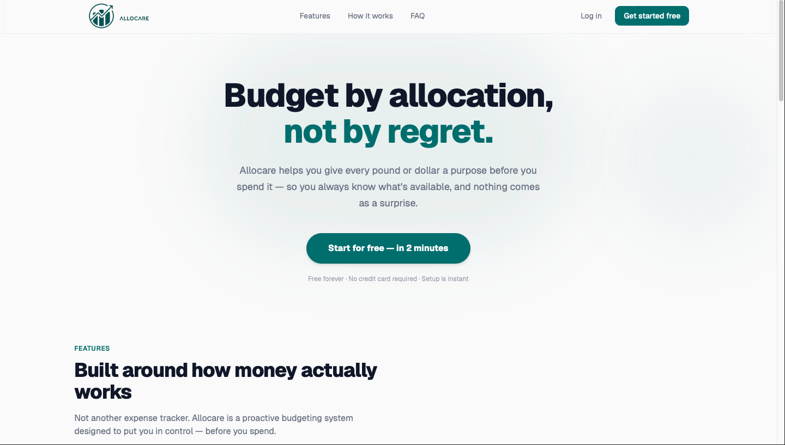 | Allocare Landing Page. |
| Register | 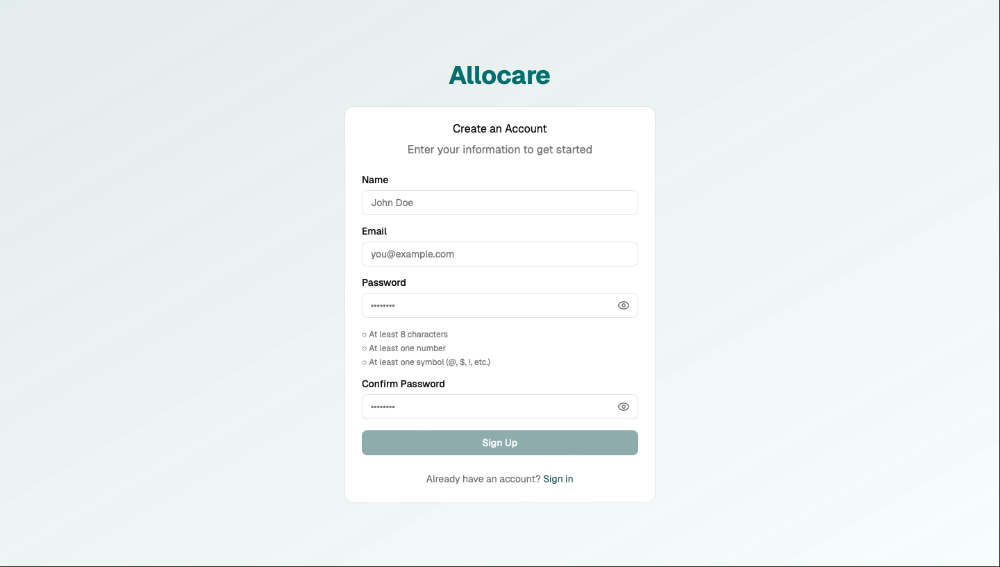 | Allocare Registration Page. |
| Login | 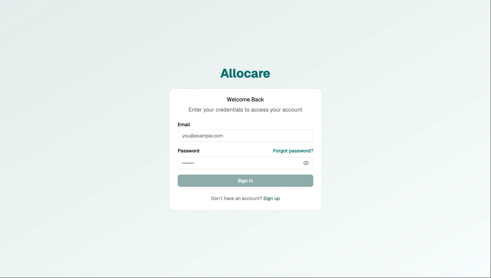 | Allocare Login Page. |
| Onboarding Step 1 | 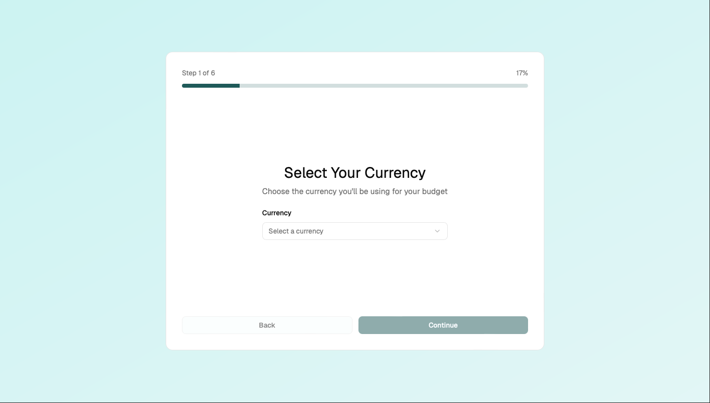 | First Onboarding Step. |
| Onboarding Step 2 | 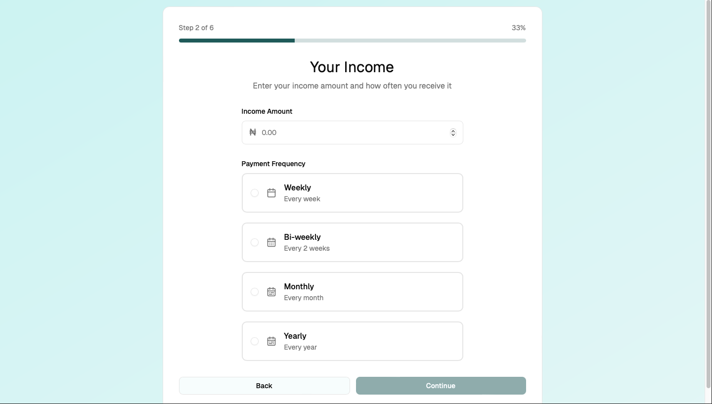 | Second Onboarding Step. |
| Onboarding Step 3 | 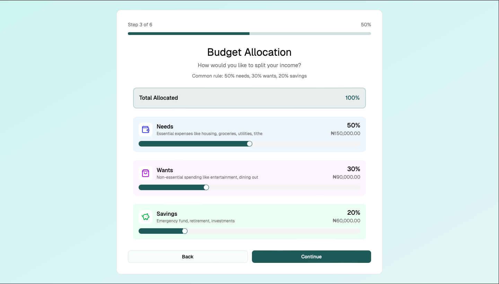 | Third Onboarding Step. |
| Onboarding Step 4 | 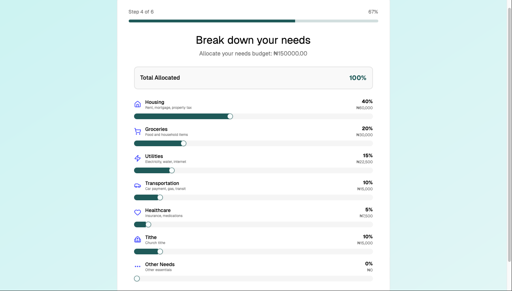 | Fourth Onboarding Step. |
| Onboarding Step 5 | 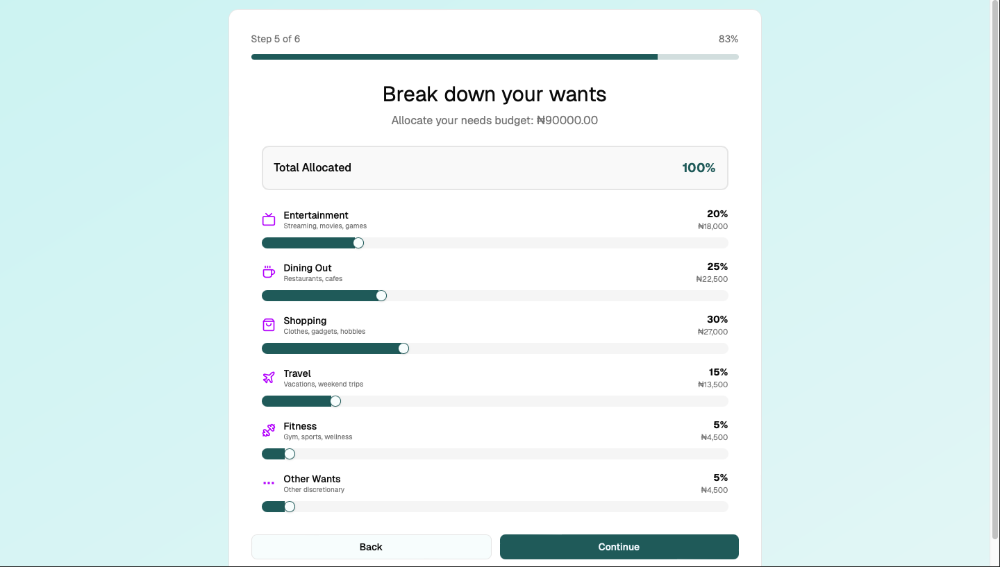 | Fifth Onboarding Step. |
| Onboarding Step 6 | 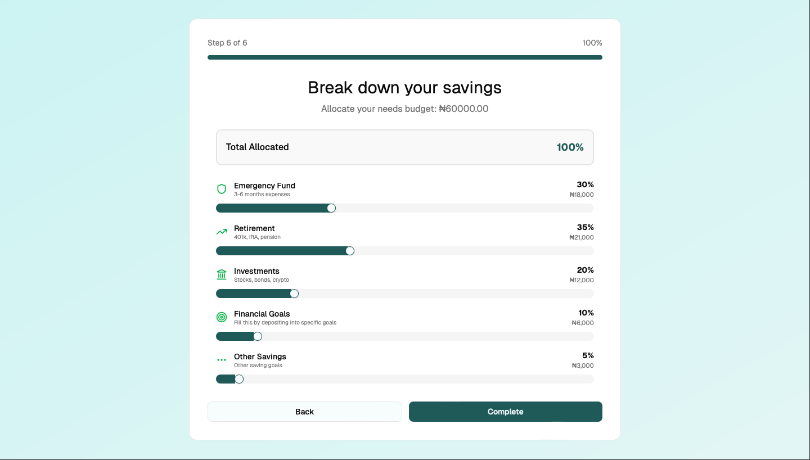 | Sixth Onboarding Step. |
| Onboarding Complete | 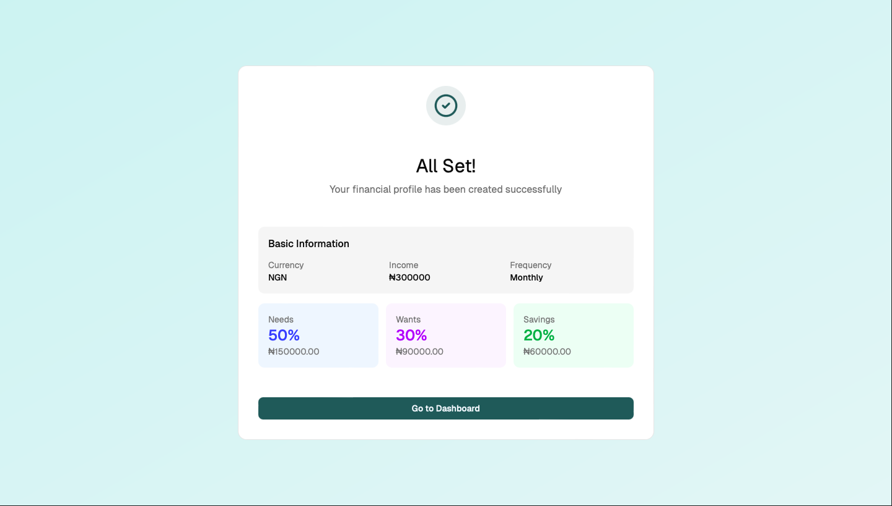 | Completed Onboarding. |
| Dashboard | 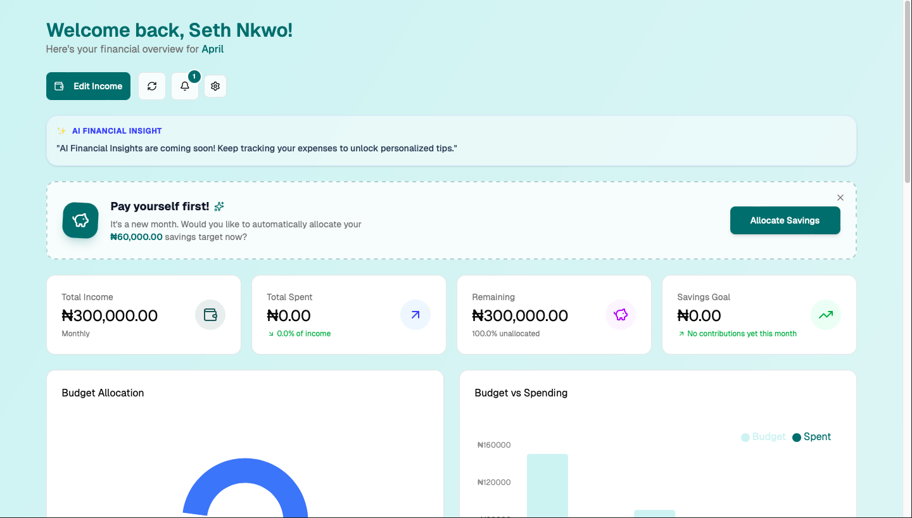 | Dashboard. |
| Dashboard | 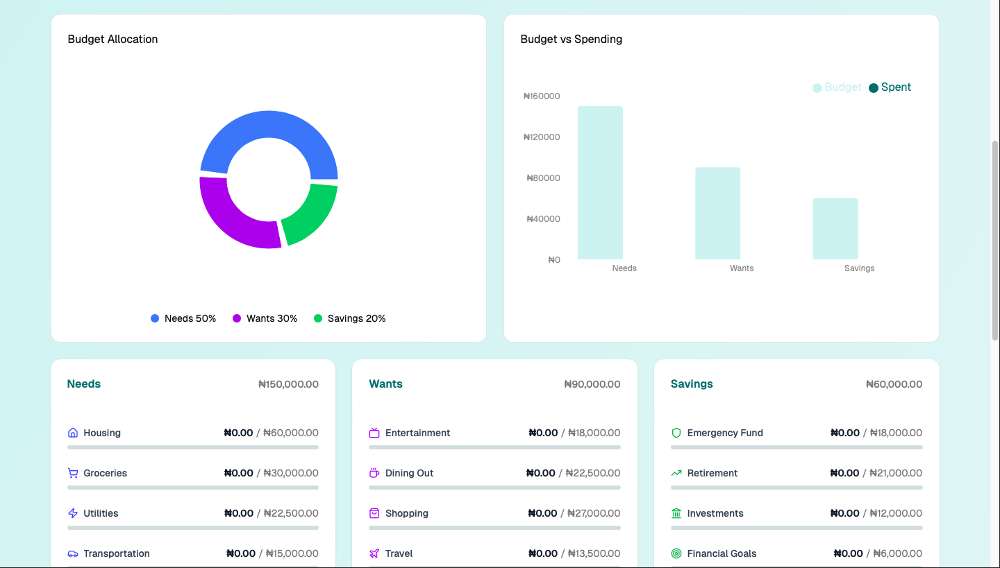 | Dashboard. |
| Dashboard | 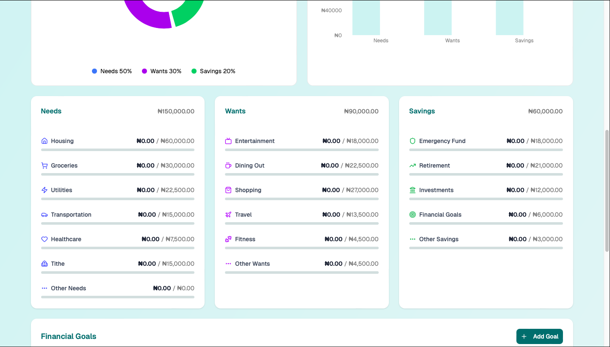 | Dashboard. |
| Dashboard | 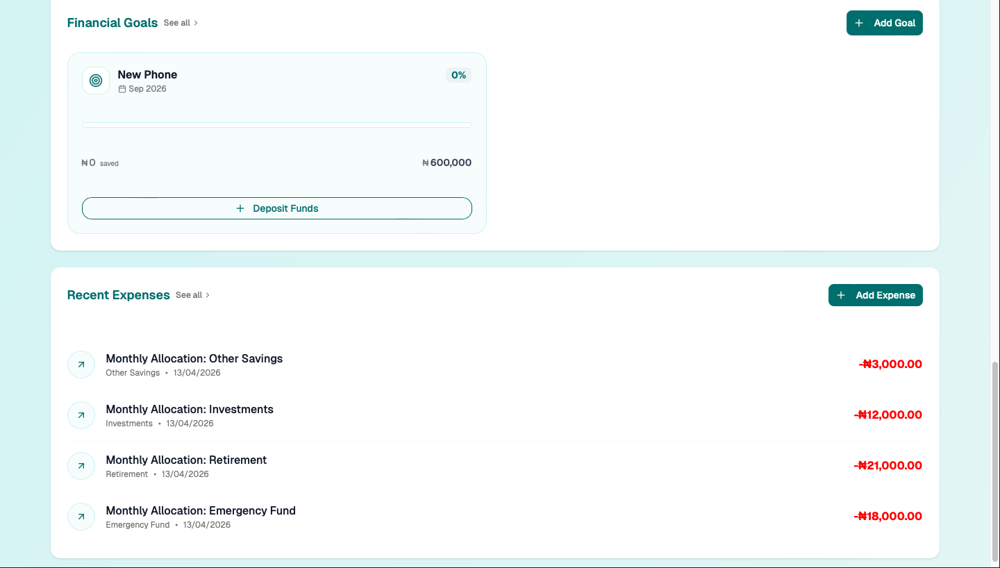 | Dashboard. |
| Notifications | 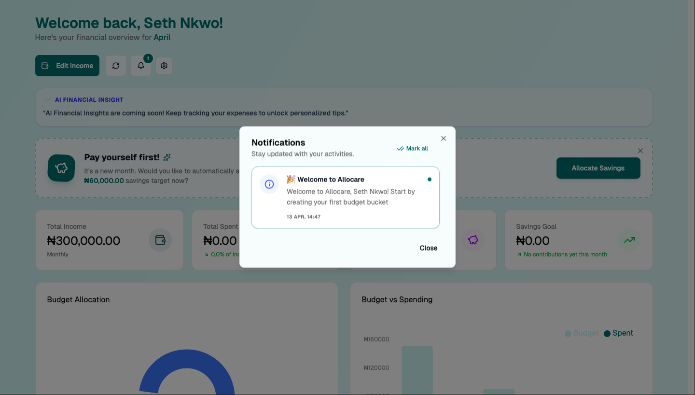 | Notifications Dialog. | 
| All Goals | 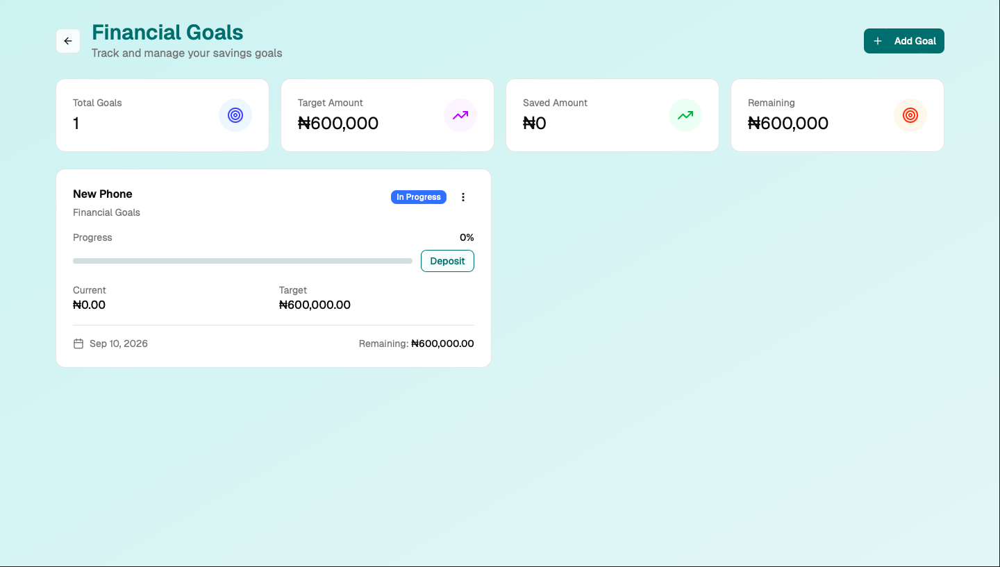 | All Goals Page. | 
| All Expenses | 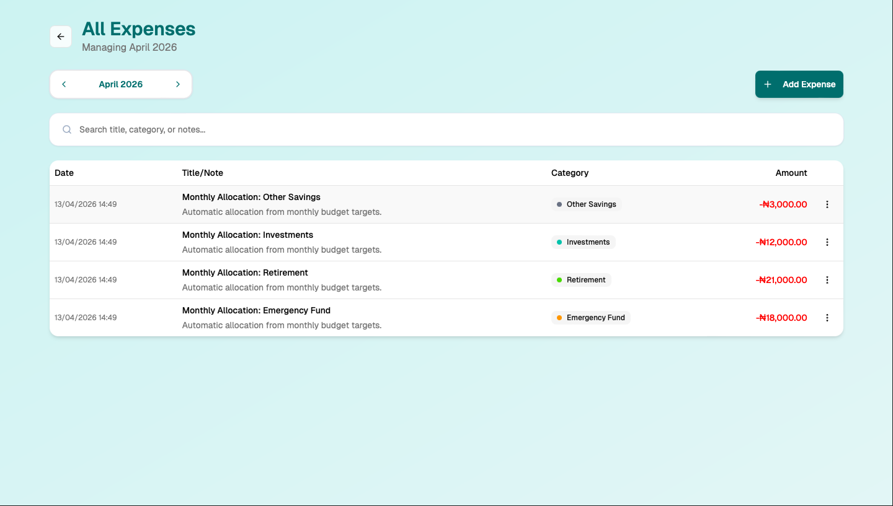 | All Expenses Page. | 
| Profile Setings | 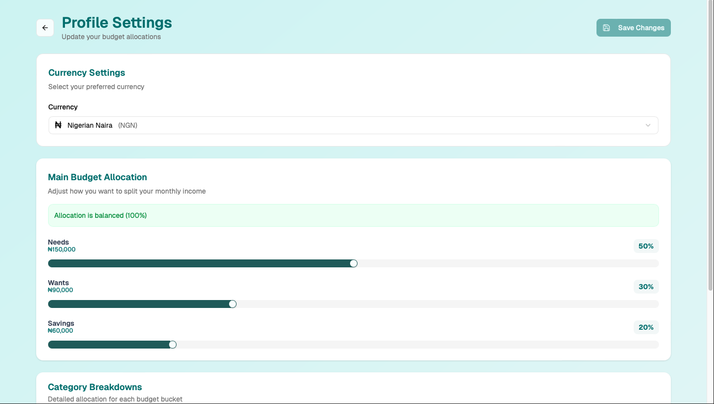 | Profile Setings Page. | 

---

## 📖 Lessons Learned
- **DNS Management**: Configuring MX, SPF, DKIM, and DMARC records to ensure high email deliverability.
- **Async Programming**: Using Python's async/await and background workers to optimize API response times.
- **State Management**: Handling complex UI states in Next.js when dealing with real-time financial calculations.
- Building real-world financial logic systems

---

## 📬 Contact
Feel free to reach out or connect:
- Portfolio: https://seth-nkwo.vercel.app
- LinkedIn: https://www.linkedin.com/in/seth-nkwo/
- GitHub: https://github.com/sethnkwo8

---

## ⭐️ Acknowledgements
This project was built as part of a full-stack development jorney, focusing on real-world application design and problem-solving.


